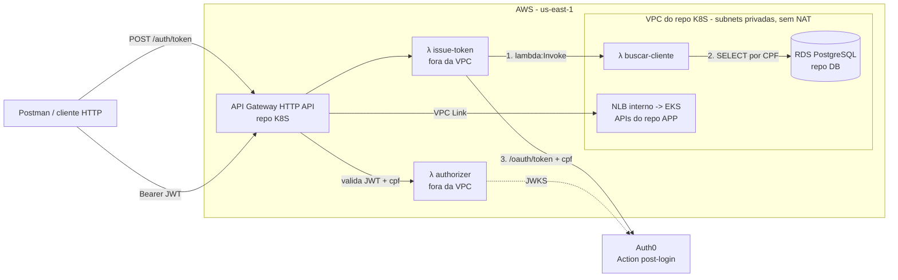

# tech-challenge-fase-3-LAMBDA-soat16-rm374658

Lambdas de autenticação do projeto **Tech Challenge Oficina** (SOAT16, fase 3), em .NET 10, publicadas com AWS SAM e mantidas por pipelines próprias no GitHub Actions.

| App SAM | Função | O que faz |
|---|---|---|
| [authorizer-app](authorizer-app/) | `techchallenge-oficina-authorizer` | Lambda authorizer do API Gateway: exige um JWT válido do Auth0 **com a claim `cpf`** |
| [issuer-token-app](issuer-token-app/) | `techchallenge-oficina-issue-token` + `techchallenge-oficina-buscar-cliente` | `POST /auth/token`: recebe email, senha e CPF, confere o cliente no banco e devolve o JWT com a claim `cpf` |

Este repositório **só cria as Lambdas**. O API Gateway, o authorizer e as rotas ficam no Terraform do repositório [**K8S**](https://github.com/GuiToniello/tech-challenge-fase-3-K8S-soat16-rm374658), que referencia as funções pelo nome. O banco é o RDS do repositório [**DB**](https://github.com/GuiToniello/tech-challenge-fase-3-DB-soat16-rm374658). As APIs, no repositório [**APP**](https://github.com/GuiToniello/tech-challenge-fase-3-APP-soat16-rm374658), continuam validando o JWT por conta própria.

## 1. Arquitetura



A geração do token usa **duas funções** porque as subnets privadas (onde está o RDS) não têm NAT nem rota para a Internet:
- a `buscar-cliente` fica dentro da VPC e só consulta o banco;
- a `issue-token` fica fora da VPC, fala com o Auth0 e invoca a `buscar-cliente` pela API da Lambda.

Assim não é preciso criar um NAT Gateway, que é cobrado por hora. O authorizer também fica fora da VPC, porque precisa buscar as chaves públicas (JWKS) do Auth0.

## 2. Fluxos

### Gerar o JWT (fluxo principal)

1. O cliente chama `POST /auth/token` com `{ "email", "senha", "cpf" }`. Essa rota é pública, sem authorizer.
2. A `issue-token` valida o CPF, que deve ter 11 dígitos e dígitos verificadores válidos.
3. A `issue-token` invoca a `buscar-cliente`, que procura no RDS um cliente com esse CPF (`clientes.identificacao`, `tipo_identificacao = 1`).
4. Se o cliente existe, a `issue-token` pede o token ao Auth0. A chamada é a mesma do Postman (`grant_type=password`), com dois parâmetros extras:
   - `cpf`: o CPF do cliente;
   - `app_secret`: o Client Secret da application.
5. A Action **post-login** do Auth0 ([auth0/post-login-cpf.js](auth0/post-login-cpf.js)) confere o `app_secret` e grava a claim `cpf` no access token, no momento da emissão. A Lambda não gera nem assina o token: quem emite e assina é o Auth0.
6. A Lambda devolve o JWT: `200 { "access_token": "<JWT com cpf>", "token_type": "Bearer", "expires_in": ... }`.
7. O cliente usa o token (`Authorization: Bearer <JWT>`) nas demais rotas do gateway.

### Cadastrar um cliente novo (exceção)

Um cliente novo ainda não está no banco, então a Lambda não teria o que encontrar. Por isso, o cadastro aceita um JWT válido **sem** a claim `cpf`, como o que o Auth0 emite quando o Postman pede o token diretamente:

1. Pedir o token direto ao Auth0 (`/oauth/token`, grant password). O token vem sem `cpf`, porque a chamada não envia o `app_secret`.
2. Chamar `POST /monolith/api/clientes` com esse token.
3. Chamar `POST /auth/token` com o CPF recém-cadastrado para obter o JWT com `cpf`.

### Regras do authorizer

| Requisição no gateway | Resultado |
|---|---|
| `GET /<api>/health` | Pública: a rota não tem authorizer |
| `POST /auth/token` | Pública: é o login |
| Sem header `Authorization` | **401**, respondido pelo próprio gateway |
| JWT inválido: assinatura, issuer, audience, expiração ou algoritmo diferente de RS256 | **403** |
| JWT válido **sem** `cpf` | **403**, exceto em `POST /monolith/api/clientes` (cadastro) |
| JWT válido **com** `cpf` | Liberado. As APIs validam o JWT de novo (`[Authorize]`) |

O resultado do authorizer não fica em cache (TTL 0), porque a decisão depende da rota e não só do token.

## 3. authorizer-app

O código fica em [authorizer-app/src/Authorizer](authorizer-app/src/Authorizer):
- [Function.cs](authorizer-app/src/Authorizer/Function.cs) contém a regra de acesso.
- [ValidadorToken.cs](authorizer-app/src/Authorizer/ValidadorToken.cs) valida o JWT com o JWKS do Auth0, que fica em cache entre invocações.

Parâmetros do template, que viram variáveis de ambiente:

| Parâmetro SAM | Variável de ambiente | Exemplo |
|---|---|---|
| `Auth0Domain` | `AUTH0_DOMAIN` | `dev-mesy5gadx7cqn4i0.us.auth0.com` (sem `https://`). Issuer esperado: `https://<domínio>/` |
| `Auth0Audience` | `AUTH0_AUDIENCE` | `http://localhost:7194` |
| `RotasSemCpf` | `ROTAS_SEM_CPF` | `POST /monolith/api/clientes`. A lista é separada por vírgula, e a comparação é exata (ignora só maiúsculas e a barra final) |

## 4. issuer-token-app

Os dois handlers ficam no mesmo projeto, [issuer-token-app/src/IssuerToken](issuer-token-app/src/IssuerToken):

| Handler | Função | Rede | Variáveis |
|---|---|---|---|
| [EmitirTokenFunction](issuer-token-app/src/IssuerToken/EmitirTokenFunction.cs) | `techchallenge-oficina-issue-token` | Fora da VPC | `AUTH0_DOMAIN`, `AUTH0_AUDIENCE`, `AUTH0_CLIENT_ID`, `AUTH0_CLIENT_SECRET`, `BUSCAR_CLIENTE_FUNCTION` |
| [BuscarClienteFunction](issuer-token-app/src/IssuerToken/BuscarClienteFunction.cs) | `techchallenge-oficina-buscar-cliente` | Subnets privadas do RDS, SG `techchallenge-oficina-lambda-sg` | `DB_CONNECTION_STRING` |

O stack também cria uma regra de entrada `5432/tcp` no SG do RDS (`techchallenge-oficina-rds-sg`), a partir do SG da `buscar-cliente`.

**`POST /auth/token`**

```json
{ "email": "cliente@exemplo.com", "senha": "SenhaDoAuth0", "cpf": "529.982.247-25" }
```

O e-mail e a senha são as credenciais do usuário no Auth0. O CPF pode vir com ou sem pontuação. Respostas possíveis:

| Status | Quando |
|---|---|
| **200** | `{ "access_token": "<JWT com a claim cpf>", "token_type": "Bearer", "expires_in": 86400 }` |
| **400** | Corpo inválido, campo vazio ou CPF inválido |
| **404** | Não existe cliente cadastrado com o CPF |
| **401** | O Auth0 recusou e-mail ou senha |
| **503** | A busca no banco falhou. Por exemplo, a função da VPC ainda está em `Pending` logo após o deploy; tente de novo |
| **502** | Erro inesperado do Auth0 |

## 5. Auth0

Não há application nova: a Lambda usa a mesma application das collections do Postman (`oficina-manager`, client `VJNHFAcEAUxr7D0PgmFA8paa01zSpj5C`), que já tem o grant *Password* habilitado.

Configuração, feita uma vez no dashboard do Auth0:

1. **Copie o Client Secret:** em **Applications → oficina-manager → Settings**, copie o **Client Secret**.
2. **Crie a Action:** em **Actions → Library → Create Action**, crie a Action "Adicionar CPF ao token" com o trigger **Login / Post Login**.
   - Cole o código de [auth0/post-login-cpf.js](auth0/post-login-cpf.js).
   - Em **Secrets**, adicione `CLIENT_SECRET` com o valor copiado no passo 1.
   - Clique em **Deploy**.
3. **Ative a Action:** em **Actions → Triggers → post-login**, arraste a Action para o fluxo e clique em **Apply**.

A Action só grava a claim quando o `app_secret` enviado no `/oauth/token` é igual ao secret `CLIENT_SECRET`. Só a Lambda envia esse valor. Quem pede o token direto ao Auth0 recebe o token sem `cpf` e, portanto, não consegue forjar um CPF sem passar pela consulta ao banco.

**Teste rápido:** use o request de token do Postman e acrescente `cpf=52998224725` e `app_secret=<Client Secret>` no corpo. A claim `cpf` deve aparecer em [jwt.io](https://jwt.io). Sem o `app_secret`, ou com outro valor, ela não deve aparecer.

## 6. Dependências entre repositórios

### Ordem

| Operação | Ordem |
|---|---|
| Deploy | **K8S** Bootstrap → **DB** Bootstrap → **APP** Bootstrap / **LAMBDA** (este repo) → **K8S** K8s Apply |
| Destroy | **LAMBDA** (este repo) → **DB** → **K8S** |

- O gateway referencia as Lambdas pelo nome. Enquanto este repo não for publicado, as rotas das APIs e o `/auth/token` respondem 500.
- **RDS ou VPC recriados** (Destroy e Bootstrap do DB ou do K8S): rode o **Deploy** deste repo manualmente. Ele descobre de novo o endpoint, as subnets e o SG, e recria a regra no SG do RDS.

### Contrato consumido

| O que | Como é encontrado |
|---|---|
| RDS (repo DB) | Variable `RDS_INSTANCE_IDENTIFIER` (`techchallenge-oficina-postgres`). O deploy obtém endpoint, banco, usuário, VPC, subnets privadas e SG com uma única chamada `aws rds describe-db-instances` |
| Senha do RDS | Secret `RDS_PASSWORD`, **o mesmo valor** dos repos DB e K8S |
| Schema (repo APP) | Tabela `clientes`, colunas `identificacao` (CPF só com dígitos) e `tipo_identificacao` (1 = CPF) |

### Contrato produzido (usado pelo repo K8S)

| Item | Valor | Uso no K8S |
|---|---|---|
| Função do authorizer | `techchallenge-oficina-authorizer` | `aws_apigatewayv2_authorizer` das rotas das APIs |
| Função do token | `techchallenge-oficina-issue-token` | Rota `POST /auth/token` |
| SG da Lambda na VPC | `techchallenge-oficina-lambda-sg` | O Destroy do K8S confere que ele já foi removido |

A permissão para o API Gateway invocar as funções (`AWS::Lambda::Permission`) é criada aqui. Ela usa um curinga no id da API, porque o id muda a cada recriação do ambiente.

## 7. Pré-requisitos (manuais, uma vez)

1. **Auth0:** a configuração da seção 5.
2. **Usuário IAM do CI:** pode ser o mesmo usuário `terraform` dos outros repos, com estas permissões a mais para o SAM:
   - **CloudFormation:**
     - `cloudformation:*` nos stacks `authorizer-app`, `issuer-token-app` e `aws-sam-cli-managed-default`;
     - `cloudformation:CreateChangeSet` em `arn:aws:cloudformation:us-east-1:aws:transform/Serverless-2016-10-31`.
   - **S3:** `s3:*` no bucket de artefatos criado pelo SAM (`aws-sam-cli-managed-default-samclisourcebucket-*`) e nos objetos dele.
   - **Lambda:** `lambda:*` em `arn:aws:lambda:us-east-1:<conta>:function:techchallenge-oficina-*`.
   - **IAM** (roles das funções, geradas pelo SAM), em `arn:aws:iam::<conta>:role/authorizer-app-*` e `role/issuer-token-app-*`:
     - `iam:CreateRole`, `iam:DeleteRole`, `iam:GetRole`, `iam:PassRole`, `iam:TagRole`, `iam:UntagRole`;
     - `iam:AttachRolePolicy`, `iam:DetachRolePolicy`, `iam:PutRolePolicy`, `iam:DeleteRolePolicy`, `iam:GetRolePolicy`.
   - **EC2:**
     - `ec2:Describe*`;
     - `ec2:CreateSecurityGroup`, `ec2:DeleteSecurityGroup`;
     - `ec2:AuthorizeSecurityGroupIngress`, `ec2:RevokeSecurityGroupIngress`;
     - `ec2:CreateTags`, `ec2:DeleteTags`.
   - **RDS:** `rds:DescribeDBInstances`.
3. **Secrets e Variables do GitHub:** veja a seção 8.
4. **Environment `destroy`** (Settings → Environments), com você como *Required reviewer* e restrito à `main`, como nos outros repos.

## 8. Secrets e Variables

| Nome | Tipo | Valor |
|---|---|---|
| `AWS_ACCESS_KEY_ID` | Secret | Credencial do usuário IAM do CI |
| `AWS_SECRET_ACCESS_KEY` | Secret | Idem |
| `RDS_PASSWORD` | Secret | Senha master do RDS, igual à dos repos DB e K8S |
| `AUTH0_CLIENT_SECRET` | Secret | Client Secret da application `oficina-manager`, o mesmo valor do secret `CLIENT_SECRET` da Action |
| `AWS_REGION` | Variable | `us-east-1` |
| `AUTH0_DOMAIN` | Variable | `dev-mesy5gadx7cqn4i0.us.auth0.com` |
| `AUTH0_AUDIENCE` | Variable | `http://localhost:7194` |
| `AUTH0_CLIENT_ID` | Variable | `VJNHFAcEAUxr7D0PgmFA8paa01zSpj5C` |
| `RDS_INSTANCE_IDENTIFIER` | Variable | `techchallenge-oficina-postgres` |

## 9. Pipelines (GitHub Actions)

| Workflow | Gatilho | O que faz |
|---|---|---|
| **Deploy** | Pull Request para `main` | Para os dois apps: `dotnet test`, `sam validate --lint` e `sam build`, sem credenciais AWS |
| **Deploy** | Push na `main` (apps ou workflows) ou manual | Testes, build e `sam deploy` dos dois stacks, um por vez |
| **Destroy** | Manual, com input `confirm = destroy` + aprovação | `sam delete` dos dois stacks |

Toda a lógica fica no workflow reutilizável [_sam.yml](.github/workflows/_sam.yml). Deploy e delete só rodam a partir da `main`. O deploy do `issuer-token-app` falha com uma mensagem clara se o RDS não existir.

## 10. Uso local

Pré-requisitos: .NET SDK 10 e AWS SAM CLI 1.151 ou mais recente (suporte ao runtime `dotnet10`). Em cada app (`authorizer-app/` ou `issuer-token-app/`):

```powershell
dotnet test test/<Projeto>.Tests   # testes unitários, sem rede e sem AWS
sam validate --lint                # valida o template (offline)
sam build                          # compila e empacota em .aws-sam/
```

O `sam local invoke` precisa de Docker. Os eventos de exemplo ficam em `events/`.

**Deploy manual** (com as credenciais do CI). O SAM não lê `.env`; o equivalente é o arquivo `params.yaml` de cada app, com um `Parâmetro: valor` por linha. Ele é ignorado pelo Git, e o `samconfig.toml` já aponta para ele (`parameter_overrides = "file://params.yaml"`). Em cada app:

```powershell
Copy-Item params.example.yaml params.yaml   # e preencha os valores
sam build
sam deploy
```

- No `issuer-token-app`, o próprio `params.example.yaml` traz o comando que mostra endpoint, VPC, subnets e SG do RDS. Preencha também o Client Secret e a senha do RDS.
- O CI não usa o `params.yaml`: a pipeline passa os valores com `--parameter-overrides`, que tem precedência sobre o `samconfig.toml`.

## 11. Testando

A collection [postman/TechChallenge.Oficina.Auth.postman_collection.json](postman/TechChallenge.Oficina.Auth.postman_collection.json) demonstra todos os casos pelo gateway:
- health público;
- 401 sem token;
- 403 com token sem `cpf`;
- cadastro com o token direto do Auth0;
- os erros 400, 404 e 401 do `/auth/token`;
- o JWT com a claim `cpf`;
- 200 com esse JWT.

Preencha `gatewayUrl` com o output `api_gateway_endpoint` do repo K8S e rode na ordem. As collections das APIs, no repo APP (`e2e/`), também passam a gerar o token por esta Lambda (environment `AWS.postman_environment.json`).

Com curl:

```powershell
$api = "https://<id>.execute-api.us-east-1.amazonaws.com"
curl.exe -s -X POST "$api/auth/token" -H "Content-Type: application/json" -d '{\"email\":\"<email>\",\"senha\":\"<senha>\",\"cpf\":\"<cpf cadastrado>\"}'
curl.exe -i "$api/monolith/api/clientes" -H "Authorization: Bearer <access_token>"
```

## 12. Destruição e custos

As Lambdas só são cobradas por invocação, e o bucket de artefatos do SAM por armazenamento. Para remover, rode o workflow **Destroy** com `confirm = destroy` e aprove no environment. Ele roda antes dos repos DB e K8S (seção 6).

O delete pode levar de 20 a 40 minutos, enquanto a AWS libera as interfaces de rede da `buscar-cliente` na VPC. O stack `aws-sam-cli-managed-default` (bucket de artefatos) não é removido.

## 13. Troubleshooting e limitações

| Sintoma | Causa provável e o que fazer |
|---|---|
| **500 em todas as rotas do gateway** | O authorizer não foi publicado (rode o Deploy deste repo) ou `AUTH0_DOMAIN` está errado |
| **403 usando o JWT da Lambda** | O token veio sem `cpf`: a Action não está no trigger post-login, ou o secret `CLIENT_SECRET` da Action é diferente de `AUTH0_CLIENT_SECRET` |
| **503 no `/auth/token`** | A `buscar-cliente` está em `Pending` ou `Inactive`, ou perdeu o acesso ao RDS. Tente de novo; se o RDS foi recriado, rode o Deploy deste repo |
| **Destroy do K8S falha no `db-check`** | O SG `techchallenge-oficina-lambda-sg` ainda existe. Rode o Destroy deste repo antes |

Limitações aceitas pelo escopo do trabalho:
- O CPF não é vinculado ao e-mail do usuário do Auth0: qualquer usuário válido obtém o token de um CPF cadastrado.
- O token não tem refresh. Peça um novo no `/auth/token` quando expirar.
- A permissão de invocação aceita qualquer API Gateway da conta, por causa do curinga no id da API.
